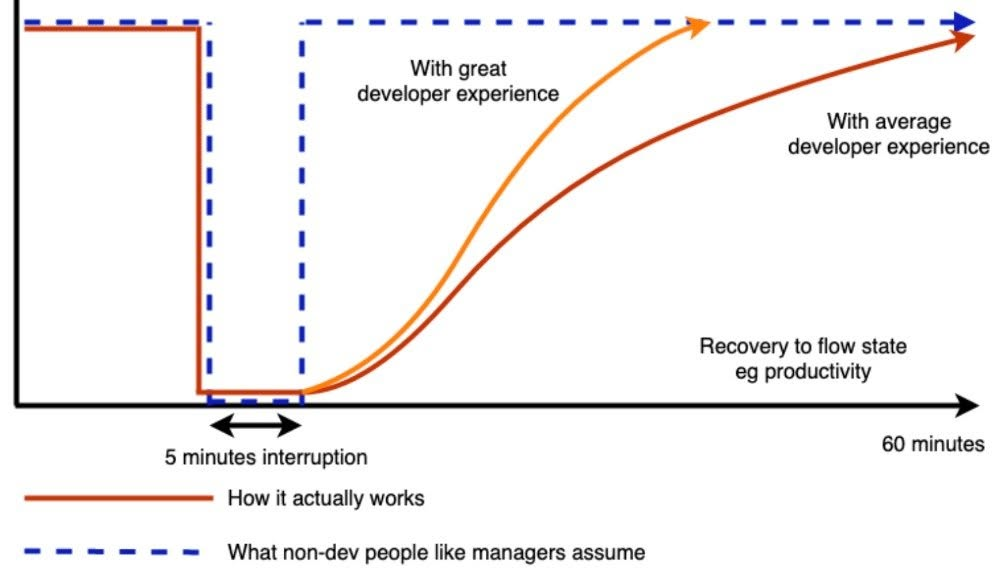
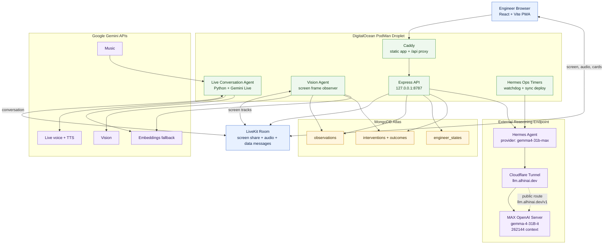
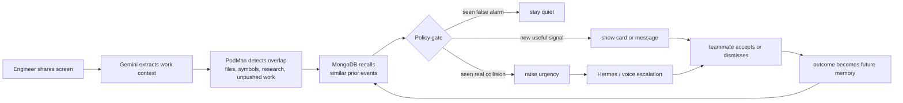
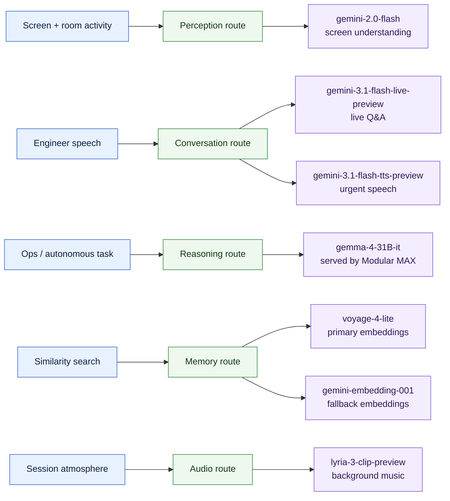
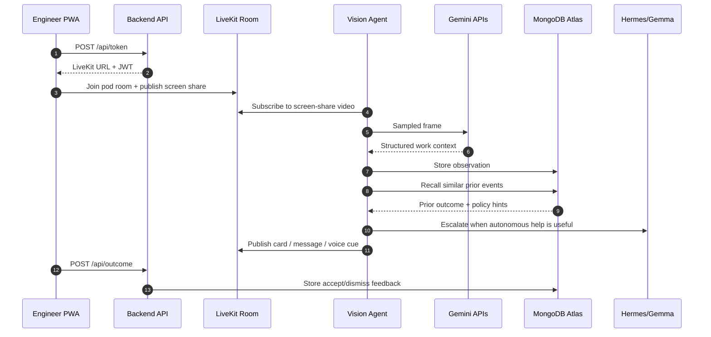
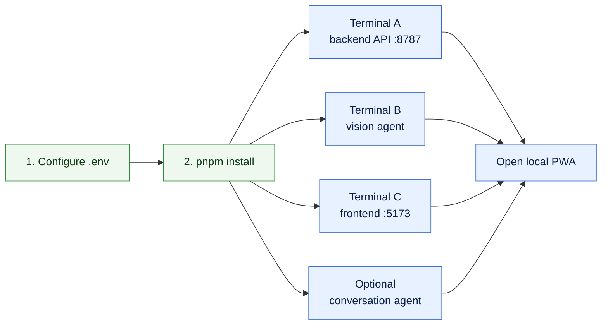
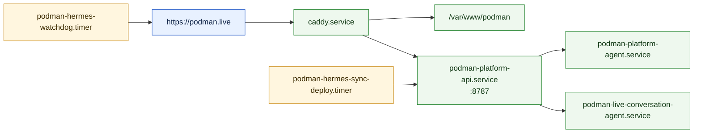

# PodMan

**An ambient pair programmer for engineering teams.**

PodMan watches the work happening inside a shared LiveKit room, understands what
each engineer is doing, remembers which interventions helped, and nudges the
team before duplicated work, merge collisions, or missed handoffs slow everyone
down.

<p align="center">
  <a href="https://podman.live/">
    
  </a>
</p>

<h2 align="center">
  <a href="https://podman.live/">Open the live production app: https://podman.live/</a>
</h2>

<p align="center">
  PodMan is already deployed. Click the link above and try the production app.
</p>

<h2 align="center">
  <a href="https://youtu.be/bWJIsIWTgr0">Watch the demo video</a>
</h2>

<p align="center">
  <a href="https://youtu.be/bWJIsIWTgr0">
    
  </a>
</p>

[LiveKit](https://livekit.io/) · [MongoDB](https://www.mongodb.com/) ·
[Gemini](https://ai.google.dev/) · [Hermes](https://hermes-agent.nousresearch.com/) ·
[Modular MAX](https://www.modular.com/max) ·
[DigitalOcean](https://www.digitalocean.com/)

<p align="center">
  
</p>

> PodMan exists to prevent the five-minute interruption from becoming a
> half-hour recovery tax.

Source image: `~/pic.jpg`, committed as
`docs/assets/interruption-flow-recovery.jpg` so it renders on GitHub.

## Read This First

| Need                    | Use this                                                                                      |
| ----------------------- | --------------------------------------------------------------------------------------------- |
| Open the product        | `https://podman.live`                                                                         |
| Check the app           | `curl https://podman.live/health`                                                             |
| Check pods and memory   | `curl https://podman.live/api/pods && curl https://podman.live/api/memory/stats`              |
| Use the LLM externally  | Base URL `https://llm.alhinai.dev/v1`, model `gemma-4-31B-it`                                 |
| Test Hermes             | `hermes -z 'Reply with exactly: working' --provider gemma4-31b-max --model gemma-4-31B-it`    |
| Start local development | API, vision agent, and frontend commands are in [Local Development](#local-development)       |
| Debug production        | Public checks first, then systemd services in [Production Operations](#production-operations) |

## Hackathon Fit

PodMan is built for the **2026 AI Engineer World's Fair Hackathon** theme:
**Continual Learning**.

It is not a wrapper chatbot or static dashboard. It is a production-running
agentic coordination system that gets better from real use: every observation,
collision, intervention, accept, dismiss, suppression, and conversation note
feeds MongoDB-backed memory so future interventions become sharper and less
annoying.

| Hackathon target       | How PodMan addresses it                                                                  |
| ---------------------- | ---------------------------------------------------------------------------------------- |
| Continual Learning     | Learns from real team behavior and accepted/dismissed interventions.                     |
| Self-Improvement Stack | Uses memory stats, Hermes jobs, production watchdogs, and deployment checks.             |
| Recursive Intelligence | Gives agents operational memory and feedback loops for improving future coordination.    |
| Live Demo              | Already deployed at [`https://podman.live/`](https://podman.live/).                      |
| Technicality           | Combines realtime media, vision, vector recall, graph traversal, memory, and ops agents. |
| Creativity             | Solves the coordination cost around AI-assisted engineering teams.                       |

### Sponsor Tech Used

| Sponsor / tech | Usage in PodMan                                                                  |
| -------------- | -------------------------------------------------------------------------------- |
| DigitalOcean   | Hosts the production app, API, workers, Caddy, and systemd-supervised services.  |
| LiveKit        | Realtime room layer for screen share, audio, data messages, and agent presence.  |
| Gemini         | Screen understanding, live room conversation, urgent TTS, embeddings, and music. |
| MongoDB Atlas  | Durable memory, `$vectorSearch`, `$graphLookup`, user learning, and job logs.    |
| Modular MAX    | Serves `gemma-4-31B-it` as the long-context reasoning model.                     |

### What To Try

```mermaid
flowchart LR
  A["Open podman.live"] --> B["Join a pod"]
  B --> C["Share screen via LiveKit"]
  C --> D["Gemini extracts work context"]
  D --> E["MongoDB recalls prior outcomes"]
  E --> F["PodMan nudges only when useful"]
  F --> G["Accept or dismiss"]
  G --> H["Memory improves next run"]

  classDef action fill:#e8f1ff,stroke:#3366cc,color:#0b1f44;
  classDef ai fill:#f4edff,stroke:#805ad5,color:#2d1857;
  classDef memory fill:#fff6df,stroke:#c47f00,color:#3d2b00;
  class A,B,C,F,G action;
  class D ai;
  class E,H memory;
```



1. Open [`https://podman.live/`](https://podman.live/).
2. Create or join a pod.
3. Add teammates and share screens.
4. Watch PodMan build live context, detect overlap, and surface intervention
   cards.
5. Accept or dismiss a card; that feedback becomes memory for the next similar
   event.

---

## Current Live System

| Surface       | Running now                  | Purpose                                |
| ------------- | ---------------------------- | -------------------------------------- |
| Product       | `https://podman.live`        | Team room, screen context, cards       |
| API           | `https://podman.live/api/*`  | Pods, tokens, outcomes, memory         |
| Health        | `https://podman.live/health` | Backend readiness                      |
| Local API     | `127.0.0.1:8787`             | Express service behind Caddy           |
| Reasoning LLM | `https://llm.alhinai.dev/v1` | OpenAI-compatible Modular/MAX endpoint |
| API key       | `not-needed`                 | Placeholder key for OpenAI clients     |
| Hermes model  | `gemma-4-31B-it`             | 262K-context tool-using agent          |
| Hermes config | `gemma4-31b-max`             | Custom provider used by Hermes locally |



## What It Does



PodMan removes the reason to interrupt. It gives the team a live picture of work
in progress, then improves from every accepted or dismissed intervention.

> GitHub sees pushed work. PodMan sees work while it is still happening.

---

## The Model Stack

PodMan uses multiple AI surfaces. They are intentionally split by job.



### Gemma 4 31B via Modular MAX

Hermes uses the external OpenAI-compatible endpoint:

```text
Base URL: https://llm.alhinai.dev/v1
API key: not-needed
Model: gemma-4-31B-it
Context: 262144 tokens
```

The Modular/MAX server is configured for long-context Gemma 4 serving:

```text
--max-length 262144
--device-memory-utilization 0.85
--kv-cache-format float8_e4m3fn
--enable-prefix-caching
--enable-chunked-prefill
--max-batch-size 1
--max-batch-input-tokens 16384
```

Hermes should point at that endpoint with this provider shape:

```yaml
model:
  default: gemma-4-31B-it
  provider: gemma4-31b-max

providers:
  gemma4-31b-max:
    name: Gemma 4 31B Modular MAX (256K)
    api: https://llm.alhinai.dev/v1
    api_key: not-needed
    transport: chat_completions
    default_model: gemma-4-31B-it
    discover_models: true
    models:
      gemma-4-31B-it:
        context_length: 262144

agent:
  tool_use_enforcement: auto
```

Why this matters: Hermes sends OpenAI tool schemas and `tool_choice: "auto"`.
The model endpoint must support automatic tool choice so Hermes can initialize
the agent without a client-side workaround.

### Modular MAX

Gemma 4 is served through Modular MAX on the GB10 machine.

| MAX support  | Value                                    |
| ------------ | ---------------------------------------- |
| Architecture | `Gemma4ForConditionalGeneration`         |
| Example      | `google/gemma-4-31B-it`                  |
| Encodings    | `float4_e2m1fnx2`, `float16`, `bfloat16` |

| Runtime           | Role                                      |
| ----------------- | ----------------------------------------- |
| Modular MAX       | OpenAI-compatible Gemma 4 serving runtime |
| `gemma-4-31B-it`  | Primary long-context reasoning model      |
| `262144` tokens   | Reported model context window             |
| `llm.alhinai.dev` | Public Cloudflare-routed model endpoint   |

### Gemini Surfaces

Gemini remains the realtime perception and voice layer inside PodMan.

| Use                        | Model                           | Code                                       |
| -------------------------- | ------------------------------- | ------------------------------------------ |
| Screen understanding       | `gemini-2.0-flash`              | `backend/src/vision/gemini.ts`             |
| Urgent spoken alerts       | `gemini-3.1-flash-tts-preview`  | `backend/src/voice/live.ts`                |
| Live room conversation     | `gemini-3.1-flash-live-preview` | `agents/podman-live-conversation/agent.py` |
| Memory embeddings fallback | `gemini-embedding-001`          | `backend/src/memory/vectors.ts`            |
| Ambient background music   | `lyria-3-clip-preview`          | `backend/src/voice/music.ts`               |

Voyage embeddings can be used first when `VOYAGE_API_KEY` is set. Gemini
embeddings remain the fallback. If no embedding provider is available, PodMan
falls back to exact-signature matching.

---

## How The Learning Loop Works

The learning loop is the product. A teammate only has to accept or dismiss an
intervention; the rest is captured automatically.

```text
observe -> detect -> recall prior outcomes -> policy gate -> act -> record outcome
   ^                                                                    |
   +-------------------------- next recall -----------------------------+
```

| Stage   | What happens                                                                | Code                                |
| ------- | --------------------------------------------------------------------------- | ----------------------------------- |
| Observe | Gemini Vision turns sampled screen frames into structured work context.     | `backend/src/vision/gemini.ts`      |
| Detect  | PodMan detects overlapping files, symbols, research, and unpushed work.     | `backend/src/collision/detector.ts` |
| Recall  | MongoDB Atlas recalls similar prior events and outcomes.                    | `backend/src/memory/vectors.ts`     |
| Gate    | Policy suppresses dismissed false alarms and escalates recurring real ones. | `backend/src/memory/policy.ts`      |
| Act     | PodMan publishes a card, Hermes message, or urgent voice cue.               | `backend/src/action/hermes.ts`      |
| Learn   | Accept/dismiss feedback is written back to memory.                          | `backend/src/memory/store.ts`       |

---

## Runtime Components

| Layer              | Runtime                             | Responsibility                                                       |
| ------------------ | ----------------------------------- | -------------------------------------------------------------------- |
| Frontend           | React + Vite                        | Pod rooms, screen share, cards, voice controls, member state         |
| Backend API        | Express on `:8787`                  | LiveKit tokens, pod CRUD, outcomes, memory stats, sync PRs           |
| Vision agent       | Node + `@livekit/rtc-node`          | Subscribes to screen tracks, samples frames, publishes interventions |
| Live voice agent   | Python LiveKit Agents + Gemini Live | Real-time voice Q&A in a pod room                                    |
| Memory             | MongoDB Atlas                       | Observations, engineer state, collisions, interventions, outcomes    |
| Reasoning agent    | Hermes + Gemma Modular/MAX          | Tool-using autonomous assistant and ops layer                        |
| Realtime transport | LiveKit Cloud                       | Screen tracks, audio tracks, data messages                           |
| Hosting            | DigitalOcean + Caddy + systemd      | Static frontend, API, workers, watchdog timers                       |

---

## Data Flow



---

## Public Interfaces

| Interface                                                   | Purpose                                        |
| ----------------------------------------------------------- | ---------------------------------------------- |
| `GET /health`                                               | API health check                               |
| `POST /api/token`                                           | Mint LiveKit room tokens                       |
| `GET /api/pods`                                             | List pods                                      |
| `GET/POST/PATCH/DELETE /api/pods`                           | Pod CRUD                                       |
| `POST/DELETE /api/pods/:id/members`                         | Pod membership                                 |
| `GET /api/pods/:id/members/:name/history`                   | Recent member work history                     |
| `POST /api/outcome`                                         | Store accepted/dismissed intervention outcomes |
| `GET /api/memory/stats`                                     | Live memory collection counts                  |
| `POST /api/sync-pr`                                         | Create a visible sync PR artifact              |
| LiveKit topic `podman.intervention`                         | Intervention data channel                      |
| Wire messages `COLLISION`, `ACK`, `GIT_REPORT`, `VOICE_CUE` | Agent/PWA contract                             |

---

## Monorepo Layout

| Folder      | Purpose                                                                 |
| ----------- | ----------------------------------------------------------------------- |
| `frontend/` | React + Vite PWA                                                        |
| `backend/`  | Express API, vision agent, memory, collision detection, Hermes job APIs |
| `agents/`   | Python LiveKit conversation agent                                       |
| `shared/`   | Shared TypeScript contracts                                             |
| `database/` | MongoDB setup and seed utilities                                        |
| `infra/`    | Caddy, Docker, DigitalOcean, systemd units                              |
| `scripts/`  | Git watcher, deploy doctor, watchdog, verification tooling              |
| `docs/`     | Demo, deployment, learning, graph, and architecture notes               |

---

## Local Development

Run the core app in three terminals:



```bash
cp .env.example .env
# Fill LIVEKIT_*, GEMINI_*, GITHUB_*, MONGODB_URI.

pnpm install
pnpm --filter @podman/backend dev       # API on :8787
pnpm --filter @podman/backend dev:agent # LiveKit vision agent
pnpm --filter @podman/frontend dev      # PWA on :5173
```

Run the Python live conversation agent:

```bash
pnpm livekit:conversation:agent
```

Run the local git watcher on each demo laptop:

```bash
node scripts/podman-agent.mjs --name <engineer-name> --pod <pod-id>
```

Demo identities:

```bash
node scripts/podman-agent.mjs --name alice --pod demo-pod
node scripts/podman-agent.mjs --name bob   --pod demo-pod
node scripts/podman-agent.mjs --name carol --pod demo-pod
```

---

## Production Operations

The production droplet is systemd-supervised. Caddy serves the built frontend
and proxies `/api/*` to the backend on `127.0.0.1:8787`.



| Service / timer                          | Purpose                                                        |
| ---------------------------------------- | -------------------------------------------------------------- |
| `podman-platform-api.service`            | Built backend API on port `8787`                               |
| `podman-platform-agent.service`          | Node LiveKit vision agent                                      |
| `podman-live-conversation-agent.service` | Python Gemini Live conversation agent                          |
| `podman-hermes-watchdog.timer`           | Periodic public health and remediation                         |
| `podman-hermes-sync-deploy.timer`        | Clean-tree fast-forward deploy loop                            |
| `caddy.service`                          | Serves `/var/www/podman`, proxies `/api/*` to `127.0.0.1:8787` |

Check the app from the outside first:

```bash
curl https://podman.live/
curl https://podman.live/health
curl https://podman.live/api/pods
curl https://podman.live/api/presence
curl https://podman.live/api/memory/stats
```

Then check the droplet services:

```bash
systemctl is-active podman-platform-api podman-platform-agent
systemctl is-active podman-live-conversation-agent
systemctl is-active podman-hermes-watchdog.timer podman-hermes-sync-deploy.timer
```

Hermes operations scripts:

```bash
pnpm hermes:watchdog
pnpm hermes:watchdog:strict
pnpm hermes:sync-deploy
pnpm deploy:doctor:strict
```

Gemma Modular/MAX endpoint checks:

```bash
curl https://llm.alhinai.dev/v1/models \
  -H "Authorization: Bearer not-needed"

curl https://llm.alhinai.dev/v1/chat/completions \
  -H "Content-Type: application/json" \
  -H "Authorization: Bearer not-needed" \
  -d '{
    "model": "gemma-4-31B-it",
    "messages": [{"role": "user", "content": "Reply with exactly: working"}],
    "temperature": 0,
    "max_tokens": 512
  }'
```

---

## Required Environment

```bash
LIVEKIT_URL=wss://your-livekit-server.livekit.cloud
LIVEKIT_API_KEY=...
LIVEKIT_API_SECRET=...
LIVEKIT_CONVERSATION_AGENT_NAME=podman-live-conversation

GEMINI_API_KEY=...
GEMINI_VISION_MODEL=gemini-2.0-flash
GEMINI_LIVE_MODEL=gemini-3.1-flash-tts-preview
GEMINI_CONVERSATION_MODEL=gemini-3.1-flash-live-preview
GEMINI_EMBEDDING_MODEL=gemini-embedding-001
GEMINI_TTS_VOICE=Charon

GITHUB_TOKEN=...
GITHUB_REPO=karti-ai/podman

MONGODB_URI=mongodb+srv://...
VOYAGE_API_KEY=...
VOYAGE_EMBEDDING_MODEL=voyage-4-lite

PORT=8787
POD_ROOM=demo-pod
```

Gemma/Hermes provider values live in Hermes config, not PodMan `.env`:

```text
provider: gemma4-31b-max
model: gemma-4-31B-it
base_url: https://llm.alhinai.dev/v1
api_key: not-needed
```

---

## Verification

Before calling a deployment healthy:

```bash
pnpm verify
pnpm verify:infra
pnpm deploy:doctor:strict
pnpm hermes:watchdog:strict
```

For the public site:

```bash
curl https://podman.live/
curl https://podman.live/health
curl https://podman.live/api/pods
curl https://podman.live/api/presence
curl https://podman.live/api/memory/stats
```

For Hermes/Gemma:

```bash
hermes -z 'Reply with exactly: working' \
  --provider gemma4-31b-max \
  --model gemma-4-31B-it
```

Expected output:

```text
working
```

---

## Troubleshooting

| Symptom                       | Likely cause                                     | Check                                                |
| ----------------------------- | ------------------------------------------------ | ---------------------------------------------------- |
| Frontend loads but API fails  | Backend or Caddy proxy issue                     | `systemctl status podman-platform-api caddy`         |
| `/api/*` returns 502          | API not listening on `8787`                      | `ss -ltnp`, `curl http://127.0.0.1:8787/health`      |
| No screen observations        | Vision agent not in LiveKit room                 | `journalctl -u podman-platform-agent -n 80`          |
| Live voice missing            | Python conversation agent down                   | `journalctl -u podman-live-conversation-agent -n 80` |
| Memory empty                  | MongoDB unavailable or env missing               | `curl /api/memory/stats`, backend logs               |
| Hermes tool calls fail        | Modular/MAX endpoint does not accept tool schema | verify Hermes provider and `/v1/chat/completions`    |
| `llm.alhinai.dev` returns 502 | Gemma server still loading or tunnel target down | `curl /v1/models`, MAX logs on Gemma host            |

---

## Why It Gets Better

PodMan is not a static alert system. It remembers what actually helped.

- A dismissed false alarm lowers future urgency.
- An accepted real collision raises future urgency for similar work.
- Exact-signature recall catches repeats even without vector search.
- MongoDB outcomes become the policy signal for the next session.
- Hermes and Gemma give the system a tool-using agent when the coordination
  problem needs active investigation instead of a passive card.

The goal is simple: fewer interruptions, fewer duplicate branches, and a team
that can move fast without constantly asking what everyone else is doing.
