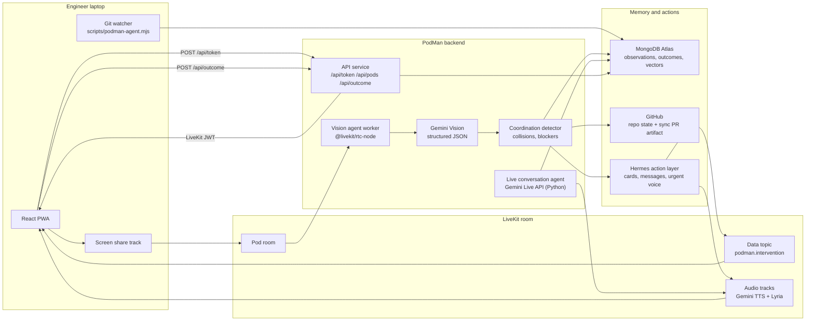
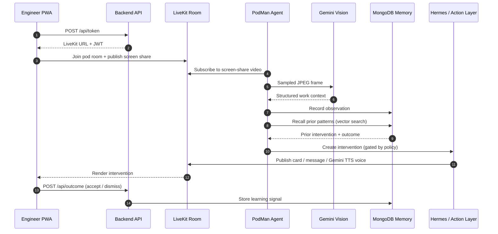

# PodMan — A Pair Programmer for Engineering Teams

[](https://livekit.io/)
[](https://www.mongodb.com/)
[](https://ai.google.dev/)
[](https://www.digitalocean.com/)

**2026 AI Engineer World's Fair Hackathon — Theme: Continual Learning**

## The bottleneck moved

Models keep getting better, and more people can build software than ever before.
Writing the code is no longer the hard part — engineering ability is not the
ceiling anymore.

What slows teams down now is everything *around* the code: manually checking each
other's work, re-planning when two people drift into the same change, and
constantly asking "what are you working on?" just to stay in sync. People
naturally want to build together — so as more people start coding, there will be
thousands of teams bottlenecked not by skill, but by the **speed of human
coordination.**

**PodMan is a pair programmer for the whole team.** It watches what every member
is doing in real time, learns your team's decisions and working dynamics, and
gives everyone a live picture of where the others are — without anyone having to
stop and ask.

### The five-minute meeting that isn't

> **What people assume:** "Quick question, five minutes."
> **What actually happens:** the interrupted developer loses their place and needs
> 15–25 minutes to climb back into deep focus. That five-minute ask quietly costs
> half an hour — for *two* people.

Multiply that by every teammate, every day, and coordination overhead — not
engineering skill — becomes the real ceiling on how fast a team ships.

PodMan removes the reason to interrupt. Because it already knows who is touching
which file, what's still unpushed, and what each person is in the middle of, any
teammate can see another's status instantly — no tap on the shoulder, no standup,
no recovery tax. And it gets better as it goes: every accept or dismiss teaches
it what your team actually cares about, so it nudges less and helps more over
time.

> GitHub sees pushed work. PodMan sees work while it is still happening — and
> remembers what helped.

---

## How it learns

The learning loop is the product, not a side feature. It runs with almost no
extra work from anyone — the only human signal is a single accept/dismiss tap on
a card.

```
observe → detect → RECALL prior outcomes → policy gate → act → record outcome
  └──────────────────────────── feeds next recall ───────────────────────────┘
```

| Stage | What happens | Code |
| --- | --- | --- |
| **Observe** | Gemini Vision turns each screen frame into structured work context (file, symbol, activity, unpushed hints) | `backend/src/vision/gemini.ts` |
| **Detect** | Same file touched by 2+ engineers with unpushed work → a coordination event | `backend/src/collision/detector.ts` |
| **Recall (memory)** | Embed the event, query MongoDB Atlas `$vectorSearch` for similar past events, attach their prior intervention + outcome | `backend/src/memory/vectors.ts` |
| **Policy gate (adapt)** | A dismissed false alarm stays silent; a confirmed real catch escalates to critical; a per-pod cooldown prevents nagging | `backend/src/memory/policy.ts` |
| **Act (least intrusive)** | Reuse the action kind that was accepted before; default to a card, escalate to a Hermes message, voice only when urgent | `backend/src/action/hermes.ts` |
| **Record (feedback)** | Accept/dismiss + "was it real?" is written back to memory, closing the loop for next time | `backend/src/memory/store.ts` |

A few things make this real learning rather than a static prompt:

- It adapts from real teammate behavior during a real session, not an offline
  dataset.
- It gets more useful as the `outcomes` collection grows — better recall, fewer
  false alarms.
- It needs one tap. No labeling, no config, no retraining.
- The mechanism is memory: Atlas vector recall plus an outcome-conditioned
  policy, with an exact-signature fallback when vector search isn't available.

In practice: a false alarm gets dismissed once, and the same pattern stays quiet
next time. A real conflict gets accepted once, and when it recurs PodMan recalls
it and escalates straight to a spoken "seen before" cue.

---

## Architecture

A browser PWA, an HTTP API service, LiveKit agent workers, and a
memory/action layer. The screen signal flows through LiveKit, never a manual
screenshot upload.



### Runtime shape

| Layer | Runtime | Responsibility |
| --- | --- | --- |
| Frontend PWA | React + Vite | Join pods, publish screen share, render interventions, play audio |
| Backend API | Express | Mint LiveKit tokens, manage pods, record outcomes, expose memory stats, create sync PRs |
| Vision agent | `@livekit/rtc-node` | Subscribe to screen-share tracks, sample frames, publish intervention data |
| Live conversation agent | LiveKit Agents (Python) + Gemini Live API | Real-time voice Q&A with function tools over repo, git, and memory |
| Perception | Gemini Vision (`gemini-2.0-flash`) | Sampled IDE frames → structured work context |
| Team memory | MongoDB Atlas | Observations, collisions, interventions, outcomes, vector embeddings |
| Git watcher | Node script | Report each laptop's dirty/unpushed state as ground truth |
| Action layer | Hermes | Cards, teammate messages, Gemini TTS urgent voice, Lyria background score |
| Deployment | DigitalOcean | Static frontend, API service, agent workers |

### Data flow



---

## Built with

Everything below maps to code in this repo.

**Gemini** does the perception, the voice, and the memory:

| Use | Model | Where |
| --- | --- | --- |
| Real-time voice agent (talk to PodMan, answered with repo/git/memory tools) | `gemini-3.1-flash-live-preview` | `agents/podman-live-conversation/agent.py` |
| Spoken urgent alerts over LiveKit | `gemini-3.1-flash-tts-preview` | `backend/src/voice/live.ts` |
| Screen understanding → structured work context | `gemini-2.0-flash` | `backend/src/vision/gemini.ts` |
| Per-pod background music (Interactions API) | `lyria-3-clip-preview` | `backend/src/voice/music.ts` |
| Embeddings for memory recall | `gemini-embedding-001` | `backend/src/memory/vectors.ts` |

**LiveKit** is the real-time layer: screen-share tracks are the input, a typed
data channel (`podman.intervention`) carries cards and messages, audio tracks
carry the spoken alerts and music, and a Python LiveKit Agents worker runs the
live conversation agent in the room.

**MongoDB Atlas** is the memory: `$vectorSearch` recalls similar past events
(exact-signature fallback when needed), and the `outcomes` collection drives the
policy that decides whether and how to act.

**DigitalOcean** hosts it: a static frontend, the API service, and the agent
workers, supervised by systemd. Mongo connectivity is required at boot — services
fail loudly rather than degrade silently.

---

## How it works

1. Engineers open the PWA and join a pod room.
2. The API mints a LiveKit token via `POST /api/token`.
3. The PWA publishes screen share into the room on "Share my screen".
4. The PodMan vision agent subscribes to the screen-share tracks.
5. The agent samples frames, sends them to Gemini Vision, records structured
   observations in MongoDB.
6. Each engineer runs the git watcher so PodMan has deterministic
   dirty/unpushed truth.
7. The detector fuses live screen context, git truth, GitHub state, and recalled
   memory.
8. The policy gate decides whether and how to act — card, Hermes message, or
   urgent voice — reusing what worked before.
9. Urgent escalations are spoken via Gemini TTS over a LiveKit audio track.
10. The teammate's accept/dismiss is saved as an outcome, closing the
    continual-learning loop.

Separately, any teammate can start a **live voice conversation** with PodMan
(Gemini Live API) to ask about current work, git state, or where something lives
in the repo — answered with real tool calls, not guesses.

---

## Public interfaces

| Interface | Purpose |
| --- | --- |
| `GET /health` | API health check |
| `POST /api/token` | Mint LiveKit room tokens |
| `POST /api/sync-pr` | Create a visible sync PR artifact |
| `POST /api/outcome` | Store accepted/dismissed intervention outcomes |
| `GET /api/memory/stats` | Memory collection counts (live learning evidence) |
| `GET/POST/PATCH/DELETE /api/pods` | Pod CRUD |
| `POST/DELETE /api/pods/:id/members` | Pod membership |
| LiveKit topic `podman.intervention` | Intervention data channel |
| Wire messages `COLLISION`, `ACK`, `GIT_REPORT`, `VOICE_CUE` | Agent/PWA contract |

---

## Monorepo layout

| Folder | What |
| --- | --- |
| `frontend/` | React + Vite PWA — pods, LiveKit room UI, screen share, intervention cards |
| `backend/` | Express API plus the LiveKit vision agent worker |
| `agents/` | Python LiveKit Agents worker for the Gemini Live conversation agent |
| `shared/` | Shared TypeScript types and LiveKit data message contracts |
| `database/` | MongoDB setup and seed utilities |
| `infra/` | DigitalOcean specs, Caddyfile, systemd units |
| `scripts/` | Local git watcher + deploy/verify tooling |
| `docs/` | Integration specs and the demo script |

---

## Quick start

```bash
cp .env.example .env
# fill in LIVEKIT_*, GEMINI_*, GITHUB_*, MONGODB_URI

pnpm install
pnpm --filter @podman/backend dev       # API on :8787
pnpm --filter @podman/backend dev:agent # PodMan LiveKit vision agent
pnpm --filter @podman/frontend dev      # PWA on :5173
```

The live conversation agent (Gemini Live API) runs from `agents/podman-live-conversation/`.

---

## Git watcher — run on every demo laptop

Each engineer runs this before the demo. It polls the local git working tree
every 15 seconds and writes git state to MongoDB so PodMan has deterministic
dirty/unpushed truth that vision alone cannot reliably infer.

```bash
# from the repo root
node scripts/podman-agent.mjs --name <yourname> --pod <podId>
```

**Demo setup:**

```bash
node scripts/podman-agent.mjs --name alice --pod demo-pod
node scripts/podman-agent.mjs --name bob   --pod demo-pod
node scripts/podman-agent.mjs --name carol --pod demo-pod
```

**Requirements:** `MONGODB_URI` exported (or in `backend/.env`), `pnpm install`
run first, launched from the repo root.
