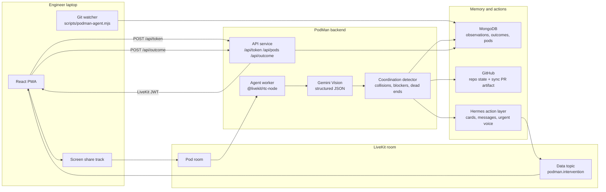
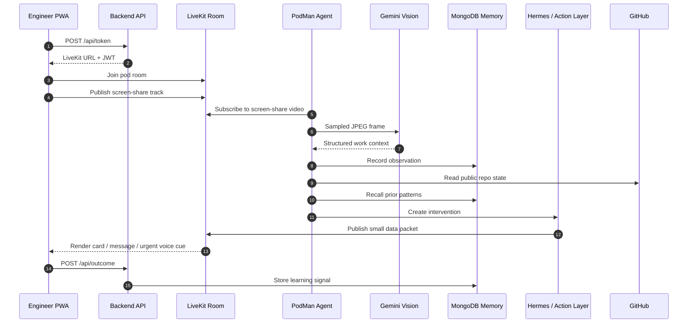

# PodMan - Real-time AI Team Coordination Agent

[](https://www.typescriptlang.org/)
[](https://react.dev/)
[](https://livekit.io/)
[](https://www.mongodb.com/)
[](https://ai.google.dev/)
[](https://www.digitalocean.com/)

**2026 AI Engineer World's Fair Hackathon** - Track: **Continual Learning**

PodMan is a non-intrusive AI teammate for active coding. It watches consented
LiveKit screen-share context, combines it with local git truth and shared team
memory, and coordinates teammates before a problem becomes a GitHub problem.

> GitHub sees pushed work. PodMan sees work while it is still happening.

PodMan is not a dashboard and not a raw screenshot analyzer. Its job is to
notice useful coordination moments, remember what helped before, and route the
least intrusive intervention: a small card first, a Hermes message when teammates
need coordination, and voice only for urgent escalation.

---

## Architecture

PodMan is split into a browser PWA, an HTTP API service, a LiveKit agent worker,
and a persistence/action layer. The screen signal flows through LiveKit, not a
manual screenshot upload endpoint.



### Runtime shape

| Layer        | Runtime             | Responsibility                                                                                      |
| ------------ | ------------------- | --------------------------------------------------------------------------------------------------- |
| Frontend PWA | React + Vite        | Join pods, publish screen share, show live room state, render interventions                         |
| Backend API  | Express             | Mint LiveKit tokens, manage pods, record outcomes, expose memory stats, create sync PR artifacts    |
| Agent worker | `@livekit/rtc-node` | Join the room as PodMan, subscribe to screen-share tracks, sample frames, publish intervention data |
| Vision loop  | Gemini              | Convert sampled IDE frames into structured work context                                             |
| Team memory  | MongoDB             | Store observations, collisions, interventions, outcomes, pods, and git watcher state                |
| Git watcher  | Node script         | Poll each laptop's local git state so dirty/unpushed work is not guessed from vision alone          |
| Action layer | Hermes concept      | Route cards, teammate messages, optional research summaries, and urgent voice escalation            |
| Deployment   | DigitalOcean        | Static site for frontend, HTTP service for API, worker for the LiveKit agent                        |

### Data flow



### Why this architecture matters

- **LiveKit is the realtime spine.** Screens and intervention data move through a
  shared room, so PodMan can react before code is pushed.
- **Gemini is the perception layer.** The agent samples frames and asks Gemini
  for structured JSON such as current file, symbol, activity, unpushed hints,
  and confidence.
- **MongoDB is the learning loop.** Outcomes and repeated patterns make later
  interventions quieter and more useful.
- **Local git is the truth source.** The watcher reports dirty files and branch
  state directly from each laptop, which avoids relying on vision for facts
  GitHub cannot see.
- **Hermes keeps it non-intrusive.** Most events are cards. Team messages and
  voice are escalation paths, not the default.

---

## How it works

1. Engineers open the PWA and join a pod room.
2. The backend API mints a LiveKit token via `POST /api/token`.
3. The PWA publishes screen share into the pod room when the engineer chooses
   "Share my screen".
4. The PodMan agent worker joins the same room and subscribes to screen-share
   tracks.
5. The agent samples frames, sends them to Gemini Vision, and records structured
   observations in MongoDB.
6. Each engineer runs the git watcher so PodMan has deterministic dirty/unpushed
   state.
7. The detector combines live screen context, git truth, GitHub state, and team
   memory.
8. PodMan sends the smallest useful intervention: card first, Hermes message for
   coordination, voice only when urgent.
9. The user's response is saved as an outcome, closing the continual-learning
   loop.

---

## Public interfaces

| Interface                                                   | Purpose                                        |
| ----------------------------------------------------------- | ---------------------------------------------- |
| `GET /health`                                               | API health check                               |
| `POST /api/token`                                           | Mint LiveKit room tokens                       |
| `POST /api/sync-pr`                                         | Create a visible sync PR artifact              |
| `POST /api/outcome`                                         | Store accepted/dismissed intervention outcomes |
| `GET /api/memory/stats`                                     | Show memory collection counts                  |
| `GET/POST/PATCH/DELETE /api/pods`                           | Pod CRUD                                       |
| `POST/DELETE /api/pods/:id/members`                         | Pod membership                                 |
| LiveKit topic `podman.intervention`                         | Intervention data channel                      |
| Wire messages `COLLISION`, `ACK`, `GIT_REPORT`, `VOICE_CUE` | Shared agent/PWA message contract              |

---

## Monorepo layout

| Folder      | What                                                                             |
| ----------- | -------------------------------------------------------------------------------- |
| `frontend/` | React + Vite PWA for pods, LiveKit room UI, screen share, and intervention cards |
| `backend/`  | Express API plus separate LiveKit agent worker                                   |
| `shared/`   | Shared TypeScript types and LiveKit data message contracts                       |
| `database/` | MongoDB setup and seed utilities                                                 |
| `infra/`    | DigitalOcean App Platform specs and Dockerfile                                   |
| `scripts/`  | Local git watcher for demo laptops                                               |
| `docs/`     | Canonical plan and deeper sponsor/integration notes                              |

---

## Docs

| File                                           | What                                      |
| ---------------------------------------------- | ----------------------------------------- |
| [`docs/PLAN.md`](docs/PLAN.md)                 | Canonical master plan and source of truth |
| [`docs/idea.md`](docs/idea.md)                 | Product concept and demo framing          |
| [`docs/livekit.md`](docs/livekit.md)           | LiveKit notes and room model              |
| [`docs/gemini.md`](docs/gemini.md)             | Gemini vision and voice notes             |
| [`docs/mongodb.md`](docs/mongodb.md)           | MongoDB memory design                     |
| [`docs/digitalocean.md`](docs/digitalocean.md) | Deployment notes                          |
| [`docs/demo-setup.md`](docs/demo-setup.md)     | Demo laptop and stage checklist           |

---

## Prizes targeted

- **Best Gemini:** structured vision over live IDE context, with voice as an
  optional escalation path.
- **Best LiveKit:** realtime screen-share tracks, presence, data packets, and
  eventual voice in one pod room.
- **Best DigitalOcean:** frontend static site, API service, and LiveKit agent
  worker deployment.
- **MongoDB + Voyage story:** persistent memory first, vector recall once exact
  signature recall is proven.

---

## Quick start

```bash
cp .env.example .env
# fill in LIVEKIT_*, GEMINI_*, GITHUB_*, and MONGODB_URI

pnpm install
pnpm --filter @podman/backend dev       # API on :8787
pnpm --filter @podman/backend dev:agent # PodMan LiveKit agent
pnpm --filter @podman/frontend dev      # PWA on :5173
```

---

## Git watcher - run this on every demo laptop

Each engineer runs this in a terminal before the demo. It polls the local git
working tree every 15 seconds and writes git state to MongoDB so PodMan has
deterministic dirty/unpushed truth that vision alone cannot reliably infer.

```bash
# from the repo root
node scripts/podman-agent.mjs --name <yourname> --pod <podId>
```

**Demo setup:**

```bash
node scripts/podman-agent.mjs --name alice --pod demo-pod
node scripts/podman-agent.mjs --name bob --pod demo-pod
node scripts/podman-agent.mjs --name carol --pod demo-pod
```

The script logs one line per cycle: branch, changed file count, and latest
commit. Leave it running in a background terminal tab throughout the session.
Stop with `Ctrl+C`.

**Requirements:**

- `MONGODB_URI` must be exported in the shell or present in `backend/.env`.
- Run `pnpm install` first so workspace dependencies are available.
- Run from the repo root.
